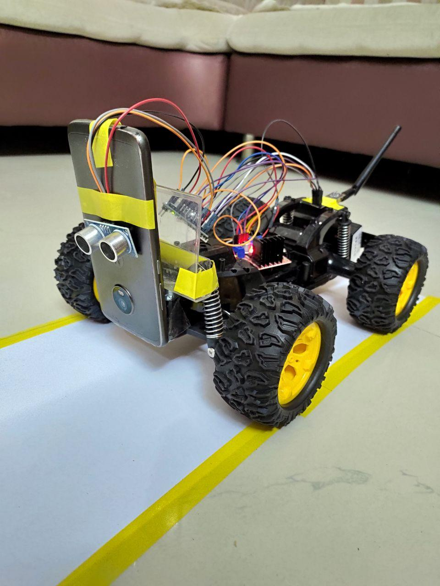

<h1 style="font-family: family:Papyrus;" align="center">Auto Car Mk II</h1>

Auto Car Mk II is an autonomous RC Car that is built from Arduino and OpenCV

Front View | Back View
--- | ---

 | 

---

Video of Mk II: https://drive.google.com/file/d/1-J92t60dJyDjMb6iAmfPrqHoX9GghsHk/view?usp=sharing

Working shots of Mk II and Mk I: https://drive.google.com/drive/folders/1caeRWpZJ2gp7c3-4RAnem3mxa90YtM-V?usp=sharing

Code Credits for OpenCV: https://www.murtazahassan.com/courses/self-driving-car-using-raspberry-pi/
